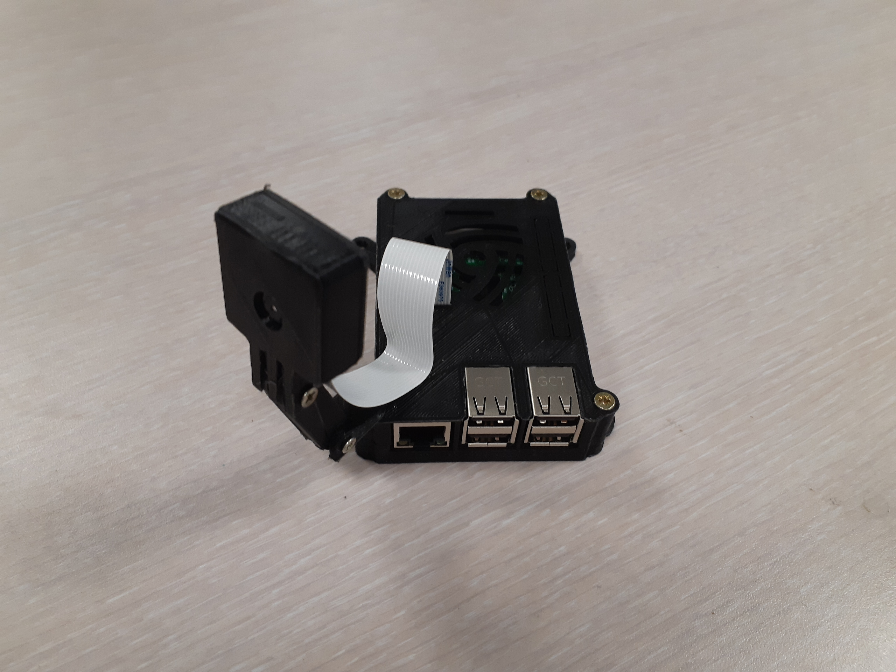
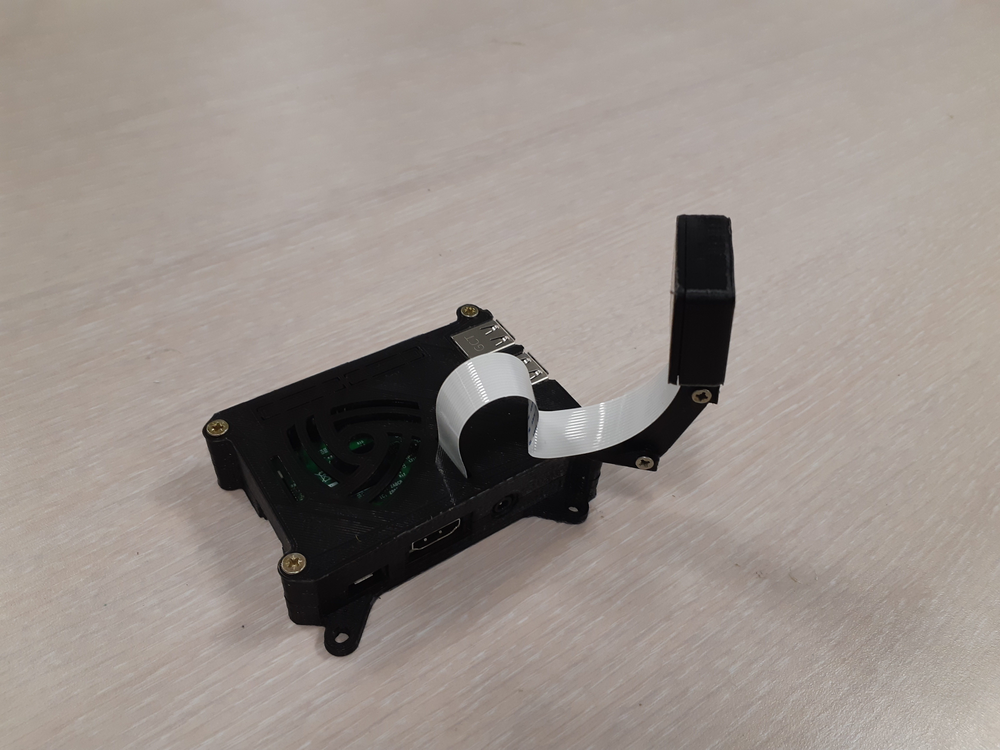

# Fiyeli Core module

## Description
This is the core module of Fiyeli.
It contains a Python script that calls a Camera module and an AI module to take a picture, count the number of persons that appear on the picture and store the data into a CSV file.

## Raspberry pi 3 case
We provide a list of 3D models avalaible on Thingiverse under  [CC BY 3.0](https://creativecommons.org/licenses/by/3.0/) or [CC BY-SA 3.0](https://creativecommons.org/licenses/by-sa/3.0/) license to create a Raspberry pi 3 case for your Fiyeli.




- [The main case](https://www.thingiverse.com/thing:922740) made by [M-P](https://www.thingiverse.com/0110-M-P/about). We used the files rpi2-top_netfabb.stl and rpi3-bottom-netfabb.stl to 3D-print our main case. It is well design for the Pi cooling and features a VESA fixing.
- The camera-case front (CameraFrontBotton-fingers.stl) and the fingerclip (fingerclip.stl) parts from the [Raspberry Pi camera additional parts](https://www.thingiverse.com/thing:403712) project by [Jim DeVona](https://www.thingiverse.com/anoved/about).
- The link (link.stl) and the camera-case back (raspberri_pi_camera_case_back_v0.4.STL) from the [Raspberry Pi Camera Mount with Ball Joint for Reprap](https://www.thingiverse.com/thing:247590) project by [Ian Williams](https://www.thingiverse.com/3dkarma/about).

## Specification
The script doesn't take any input and doesn't produce an output.\
Execute with the command :
```
python routine.py
```
After execution, a CSV file named `<year>-<month>-<day>.csv` has been created (if not already existing) in the core data directory, and the line `<timestamp>;<number of persons>` has been added.\
The core data directory must be stored in a `FIYELI_DATA` environment variable.\
The picture is then removed.

## Other modules specifications

### Camera
Must generate a 1024x768 jpg file named `<timestamp>.jpg` into the core image directory.\
This core image directory needs to be stored in a `FIYELI_IMAGES` environment variable.\
The complete command to take the picture and store it in the correct directory needs to be stored in a `FIYELI_CAMERA_SHOT` environment variable.

### AI
Must take a 1024x768 jpg file as input and return an int which correspond to the number of persons that are on the picture.\
The complete command to execute the person detector program needs to be stored in a `FIYELI_AI_RUN` environment variable, and the picture used as input needs to be the last argument to the command (the picture will be appended to the command by our core script).
